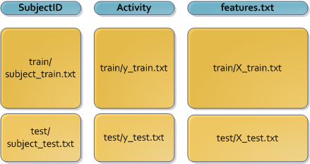

DataScience3_CourseProject
==========================

Repository for the course project.

This repository contains the tidy version of the UCI HAR Dataset: UCI_HAR_TidyDataset.txt (see Codebook.md). The script which generates this dataset is run_analysis.R.

## Steps to obtain the tidy dataset (run_analysis.R)

1. Merged the training and the test sets to create one single dataset in one table. This is done as Figure 1 shows (note that data in 'Inertial Signals' folder were not used).

 

2. Extracted only the measurements on the mean and standard deviation for each measurement. Only features with "-mean(" or "-std(" are considered valid here (e.g. "tBodyAcc-mean()-X", "tBodyAcc-std()").  So, fBodyBodyGyroJerkMag-meanFreq() or angle(tBodyAccMean,gravity) were NOT considered. This was done because these other measurements with "mean" does not have a "std" counterpart.

3. Changed activity numeric values (1-6) to factor values ("WALKING", "WALKING_UPSTAIRS", "WALKING_DOWNSTAIRS", "SITTING", "STANDING", "LAYING").

4. Included labels on all features (names on features.txt were used)

5. Calculated the mean of all features by SubjectID and Activity. All features now are the averages values. In order to emphasize that, they are identified as "[MEAN]".

Finally, the dataset was exported to CSV format (separator = ","). Script "run_analysis.R" perform all these steps on the original dataset provided by the authors.